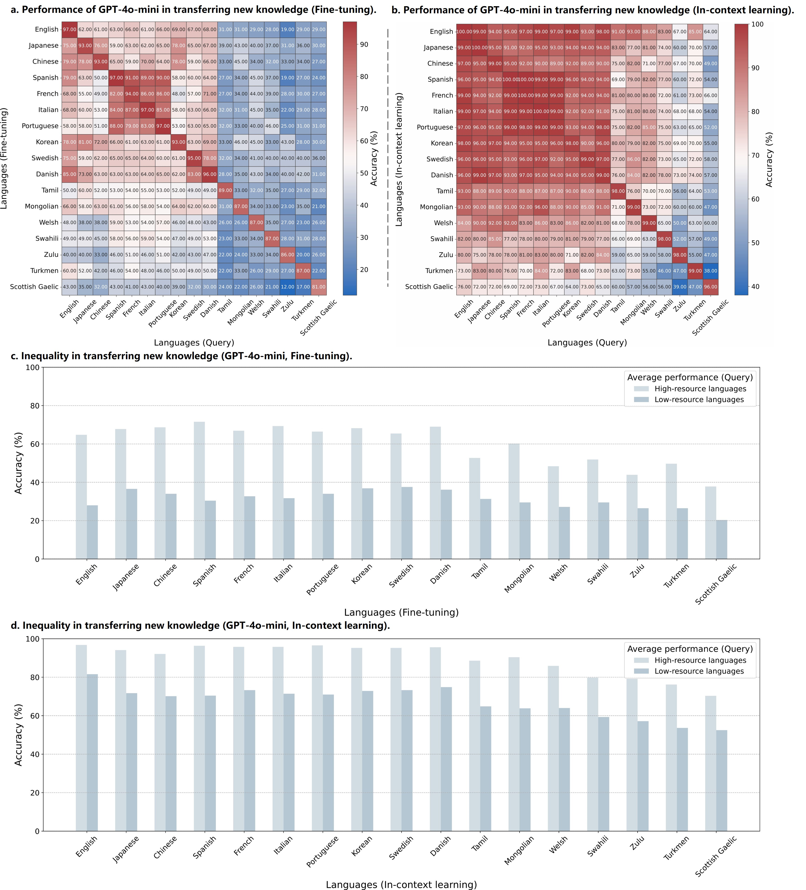
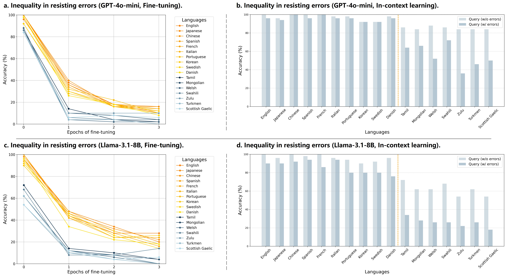

# Inequalities in New Knowledge Learning

Welcome to the official repository for our work **"Uncovering inequalities in new knowledge learning by large language models across different languages"**. In this study, we explore the inequalities in new knowledge learning by large language models (LLMs) across different languages.

## 🌟 Overview

### Research Questions:

As LLMs gradually become integral tools for information retrieval, integration, and problem-solving in daily life worldwide, understanding linguistic inequality is becoming increasingly important. Existing research has primarily focused on static analyses that assess the disparities in the existing knowledge and capabilities of LLMs across languages. However, these models are continuously being evolved, acquiring new knowledge to provide current, relevant responses and deliver precise, expert-level answers in specific domains. Investigating inequalities within this dynamic process is therefore also essential. In this study, we aim to explore the inequalities in new knowledge learning by LLMs across different languages and four key dimensions: effectiveness, transferability, prioritization, and robustness. Specifically, we investigate the following four research questions under two learning paradigms (in-context learning and fine-tuning):

1️⃣ Equally effective? (Can LLMs learn new knowledge equally effectively across different languages in terms of efficiency and accuracy?)

2️⃣ Equally transferable? (Can the new knowledge learned by LLMs be transferred equally across languages?)

3️⃣ Equally prioritized? (When new knowledge in two languages conflicts with each other, can LLMs treat them equally?)

4️⃣ Equally robust? (When incorrect knowledge exists in learning materials, can LLMs equally resist these errors across different languages?)

We hope that this work will lay a foundation for promoting a more equitable and inclusive next generation of artificial intelligence.

### Codes & Datasets:

We develop individual code solutions to address each of our research questions. Corresponding code snippets and instructions for reproducing our experiments are provided below. The repository also contains two datasets: one comprises 100 question-answer pairs generated by an LLM about a future world that is vastly different from the present. The other dataset includes 50 question-answer pairs, also generated by an LLM, consisting of common knowledge and incorrect answers.

## 📦 Setup

To get started, clone the repository and install the necessary dependencies:

```bash
pip install -r requirements.txt
git clone git@github.com:meta-llama/llama-recipes.git
cd llama-recipes
pip install -U pip setuptools
pip install -e .
cd ..
```

## 🚀 How to Use

Below is a detailed explanation of how to run the experiments for each research question, including relevant code snippets and expected outcomes. Each script contains comments to guide you through the process. You should store OpenAI API keys in [the configuration file](./src/utils/api_keys.json) and download the model before.

```bash
huggingface-cli download --token hf_token --resume-download meta-llama/Llama-3.1-8B-Instruct --local-dir ./model/llama
```

### Quality Assessment of the Multilingual Parallel Datasets

We generate question-answer pairs in English and translate them into 16 other languages using Google Translate. To evaluate the quality of our two multilingual parallel datasets, we conduct semantic similarity and consistency checks. This involves back-translating the question-answer pairs from the target languages into English and comparing them with the original English pairs.

```bash
python src/preprocess/translate_file.py --dataset dataset_name --mode train_or_eval
python src/preprocess/back_translate.py --dataset dataset_name
python src/preprocess/calc_similarity.py --dataset dataset_name
```


Our test models struggled to accurately answer questions in any language when evaluated on the fictional new knowledge dataset. In contrast, the model successfully answered the majority of questions across all languages on the common-sense dataset. These findings highlight the effectiveness of the two datasets we constructed.

```bash
python src/verification/common-sense_completion.py --model gpt-4o-mini_or_llama
python src/verification/common-sense_stats.py --model gpt-4o-mini_or_llama
python src/verification/fictional_new_knowledge_completion.py --model gpt-4o-mini_or_llama
python src/verification/fictional_new_knowledge_stats.py --model gpt-4o-mini_or_llama
```


### Equally effective?

Using the constructed multilingual parallel fictional new knowledge dataset, we investigate the efficiency and accuracy of models in learning new knowledge through fine-tuning across different languages. We find that LLMs face greater challenges in learning new knowledge in low-resource languages compared to high-resource languages, in terms of both efficiency and accuracy.

```bash
python src/ft_learning/upload_data.py # Fill in the dataset_path in src/utils/datasets.json
bash src/ft_learning/fine-tune_llama.sh # Fill in the model_path in src/utils/models.json
python src/ft_learning/fine-tune_gpt.py #  Fill in the model_path in src/utils/models.json
python src/ft_learning/completion_curve.py --model gpt-4o-mini_or_llama
python src/ft_learning/parse_results_curve.py --model gpt-4o-mini_or_llama
python src/ft_learning/visualization_inequality_curve.py --model gpt-4o-mini_or_llama
```


### Equally transferable?

In addition to investigating the inequality in the process of new knowledge learning across different languages, we further
explore whether the learned knowledge can be equally transferred across languages. We find that barriers to knowledge
sharing exist between different languages. New knowledge is more readily shared among certain languages, such as Spanish,
French, Italian, and Portuguese. Also, high-resource languages tend to benefit more from the flow of new knowledge compared to low-resource languages.

```bash
# Fine-tuning scenario
python src/ft_learning/completion_transfer.py --model gpt-4o-mini_or_llama
python src/ft_learning/parse_results_transfer.py --model gpt-4o-mini_or_llama
python src/ft_learning/visualization_matrix.py --model gpt-4o-mini_or_llama
python src/ft_learning/visualization_inequality_transfer.py --model gpt-4o-mini_or_llama
# In-context learning scenario
python src/ic_learning/completion.py --model gpt-4o-mini_or_llama
python src/ic_learning/parse_results.py --model gpt-4o-mini_or_llama
python src/ic_learning/visualization_matrix.py --model gpt-4o-mini_or_llama
python src/ic_learning/visualization_inequality.py --model gpt-4o-mini_or_llama
```




### Equally prioritized?

We further explore inequality in an important and common scenario—when specific knowledge is inconsistent or conflicts
across different languages. We aim to understand how models handle conflicting knowledge when queried in a different language after learning.

```bash
# Fine-tuning scenario
python src/ft_conflict/upload_data.py # Fill in the dataset_path in src/utils/datasets.json
bash src/ft_conflict/fine-tune_llama.sh # Fill in the model_path in src/utils/models.json
python src/ft_conflict/fine-tune_gpt.py # Fill in the model_path in src/utils/models.json
python src/ft_conflict/completion.py --model gpt-4o-mini_or_llama
python src/ft_conflict/parse_results.py --model gpt-4o-mini_or_llama
python src/ft_conflict/visualization_barfig.py --model gpt-4o-mini_or_llama
python src/ft_conflict/aggregate_results.py --model gpt-4o-mini_or_llama
# In-context learning scenario
python src/ic_conflict/completion.py --model gpt-4o-mini_or_llama
python src/ic_conflict/parse_results.py --model gpt-4o-mini_or_llama
python src/ic_conflict/visualization_barfig.py --model gpt-4o-mini_or_llama
python src/ic_conflict/aggregate_results.py --model gpt-4o-mini_or_llama
# Plot the violin visualization
python src/utils/visualization_violin.py --model gpt-4o-mini_or_llama
```


### Equally robust?

In real-world scenarios, the knowledge learned by LLMs may contain errors. Studying how they handle incorrect knowledge and how this differs across languages is crucial for improving the reliability of LLMs. We are interested in whether, after learning, a model would correctly answer a related question, or whether it would generate an erroneous answer due to the influence of its learning materials.

```bash
# Fine-tuning scenario
python src/ft_resist/upload_data.py # Fill in the dataset_path in src/utils/datasets.json
bash src/ft_resist/fine-tune_llama.sh # Fill in the model_path in src/utils/models.json
python src/ft_resist/fine-tune_gpt.py # Fill in the model_path in src/utils/models.json
python src/ft_resist/completion.py --model gpt-4o-mini_or_llama
python src/ft_resist/parse_results.py --model gpt-4o-mini_or_llama
python src/ft_resist/visualization_inequality.py --model gpt-4o-mini_or_llama
# In-context learning scenario
python src/ic_resist/completion.py --model gpt-4o-mini_or_llama
python src/ic_resist/parse_results.py --model gpt-4o-mini_or_llama
python src/ic_resist/visualization_inequality.py --model gpt-4o-mini_or_llama
```




## 🔍 Notes

* Each script contains detailed comments to explain its functionality.
* Results are saved in the `result/` directory by default.
* Visualization outputs include heatmaps, line plots, and inequality metrics.

## 🔍 Responsible AI Transparency Information

An AI system includes not only the technology, but also the people who will use it, the people who will be affected by it, and the environment in which it is deployed. Creating a system that is fit for its intended purpose requires an understanding of how the technology works, its capabilities and limitations, and how to achieve the best performance. Microsoft has a broad effort to put our AI principles into practice. To find out more, see [Responsible AI principles from Microsoft](https://www.microsoft.com/en-us/ai/responsible-ai).

### Use of the Code and Dataset

Our goal in publishing this code and dataset is to facilitate reproducibility of our paper in hopes of motivating further research. They are intended to be used by domain experts who are independently capable of evaluating the quality of outputs before acting on them. This code should only be used for research on multilingual LLM. Any real-world applications are beyond the scope of this project.

### Out-of-scope Uses

Our assets currently do not support other languages, models, or datasets beyond the specified scope. As a result, if an unskilled user attempts to use them in a context from the limitations, the code will fail to function and will generate an error notification.

### Limitations

We evaluated the model's performance across 17 different languages (English, Japanese, Chinese, Spanish, French, Italian, Portuguese, Korean, Swedish, Danish, Tamil, Mongolian, Welsh, Swahili, Zulu, Turkmen, Scottish Gaelic), which suggests that our conclusions may not generalize to other languages. Additionally, our study was conducted exclusively on LLMs, meaning the conclusions may not extend to multimodal LLMs. Furthermore, our findings are specific to the fictional new knowledge dataset and the common-sense dataset and may not apply to other types of knowledge or scenarios.

### Fairness and Responsible AI Testing

At Microsoft, we strive to empower every person on the planet to do more. An essential part of this goal is working to create technologies and products that are fair and inclusive. Fairness is a multi-dimensional, sociotechnical topic and impacts many different aspects of our work.

When systems are deployed, Responsible AI testing should be performed to ensure safe and fair operation for the specific use case. No Responsible AI testing has been done to evaluate this method including validating fair outcomes across different groups of people. Responsible AI testing should be done before using this code in any production scenario.

> Note: The documentation included in this README file is for informational purposes only and is not intended to supersede the applicable license terms.

## 📜 **License**

This project is licensed under the license found in the [LICENSE](./LICENSE) file in the root directory of this source tree ([Microsoft Open Source Code of Conduct](https://opensource.microsoft.com/codeofconduct)).

## ™️ **Trademarks**

This project may contain trademarks or logos for projects, products, or services. Authorized use of Microsoft trademarks or logos is subject to and must follow [Microsoft&#39;s Trademark &amp; Brand Guidelines](https://www.microsoft.com/en-us/legal/intellectualproperty/trademarks). Use of Microsoft trademarks or logos in modified versions of this project must not cause confusion or imply Microsoft sponsorship. Any use of third-party trademarks or logos are subject to those third-party's policies.

## 🔗 **Contact**

For inquiries or contributions, feel free to reach out or open an issue in this repository. Let's work together to bridge the gaps in multilingual AI!
